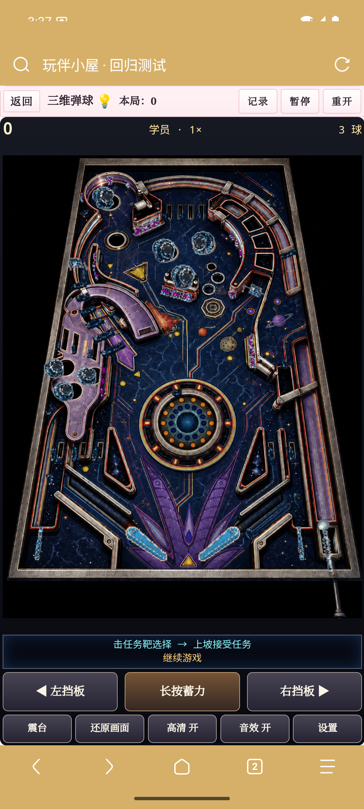

# 3.10：归档、高清弹球与消消乐拓展

发布到此 fork 的 `main`。已安装用户在酒馆扩展管理点击更新后刷新，或在「小屋 → 设置 → 更新插件 → 刷新生效」完成原地更新；无需卸载。安装地址仍为 https://github.com/JackLee992/USER_HOUSE 。

## 内容

- 空当接龙：一键安全归档、随步归档开关、桌面双击／手机快速双点合法送牌；自动连收与玩家移动合成一条撤回记录。详见 [规则](freecell-rules.md)。
- 三维弹球：高清静态球台直接按设备像素显示，不再先缩到365像素再放大。普通视图约385像素宽，放大视图约406像素宽；同局可切回经典画面。原引擎动态球、灯、挡板与深度遮挡保留。导入原版DAT时使用该素材自身画面。
- 消消乐：四连清线、五连彩虹、L／T爆弹及六类特效组合；经典闯关、破冰挑战、无限休闲分别保存进度。本局共享星星金币、通关发奖、小锤和重排；失败可保留奖励重试。详见 [规则及奖励范围](match3-rules.md)。

消消乐奖励是本局存档的一部分，返回目录、刷新及失败重试保留；明确结束或重开才清零。尚未提供跨新局的钱包。

## 验证环境与结果

Android 15 / API35 arm64 模拟器，Via 7.3.3，WebView 124，412×746 CSS视口，DPR 2.625。使用仓库测试宿主加载实际插件runtime和游戏模块，替代酒馆的角色/聊天外部接口；触摸操作发到真实 Via WebView。没有以桌面移动尺寸替代 Android 验收。弹球以 ADB 原生截图确认，避免 Via 的 CDP 截图遗漏 iframe。

- [空当接龙触控记录](evidence/v3.10/via-freecell-enhancements-checks.json)：13项通过，包含新随机52牌走子、空当/列中双点、非法及被遮挡双点、安全批收、随步开关、整组撤销、暂停和目录继续。
- [高清弹球显示](evidence/v3.10/via-cadet-display.json)：普通1011×1302、放大1066×1373设备像素，源底图1105×1423；放大保留完整球台及控件；暂停时切画质/尺寸不推进物理。约3秒采样，墙钟3061ms、引擎3048ms，单次显示合成0.3–0.6ms。此结果仅代表该测试模拟器。
- [弹球完整流程](evidence/v3.10/via-cadet-checks.json)：343组件、蓄力、双指挡板、暂停、Android Home后台/前台、目录继续、刷新检查点与重开通过。
- [弹球自然三球](evidence/v3.10/via-cadet-natural.json)：实际发射后3→2→1→0球，199750分、军衔4，插件正常结算。
- [素材回归](evidence/v3.10/via-cadet-assets.json)：使用已打包的CC0 DAT验证真实输入处理器、IndexedDB、原画面回退和内置高清恢复。未测试专有DAT；该用例未覆盖原生文件选择器。
- [消消乐触控记录](evidence/v3.10/via-match3-enhancements-checks.json)：17项通过，原生玩法下拉、模式确认/恢复，实际交换制造4/5/L/T特效，破冰、星币、道具、暂停及零步存档继续。
- [Node回归输出](evidence/v3.10/node-tests.txt)：120项通过，覆盖规则、存档、生命周期、像素合成及官方更新接口适配逻辑。

弹球动态精灵仍是经典分辨率，这次高清改善集中在静态球台与显示尺寸；没有逐个手工通关所有Space Cadet任务。三消使用本项目制定的规则和原创素材，不是商业游戏的完整移植。

## 复现

按 [Via环境说明](via-regression.md) 启动测试宿主与模拟器，再执行：

```sh
node --test tests/*.test.mjs
node tests/browser/android-cadet-display.mjs /path/to/evidence
node tests/browser/android-space-cadet.mjs /path/to/evidence
node tests/browser/android-cadet-natural.mjs /path/to/evidence
node tests/browser/android-cadet-assets.mjs /path/to/evidence
node tests/browser/android-freecell-enhancements.mjs /path/to/evidence /path/to/freecell-browser-results.json
node tests/browser/android-match3-enhancements.mjs /path/to/evidence
```

空当接龙完整测试牌局来自 `tests/freecell-browser.mjs` 的JSON输出，也收录在本版Via原始记录的 `fixtures` 字段，可将该文件直接作为最后一个参数。部署用WASM、源码补丁和SHA256见 [构建说明](../tools/space-cadet/BUILD.md)。




发布后已通过官方酒馆路由，将实际隔离的3.9.0插件副本更新到本版代码提交 `24b8269`，确认版本3.10.0与远程main一致，无卸载/安装调用。见 [原地更新记录](evidence/v3.10/native-update-to-3.10.json)。
