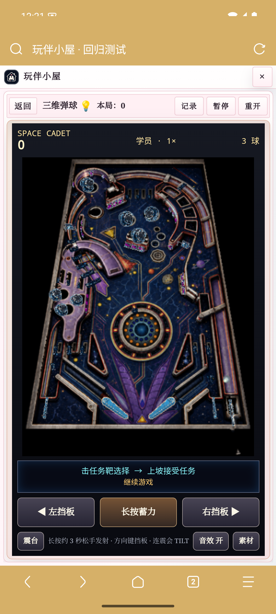

# 三维弹球：完整 Space Cadet

3.10 新增高清显示与放大画面：内置 1105×1423 重绘底图直接适配设备像素，动态球、挡板、靶和灯继续使用原引擎精灵。普通视图约385像素宽，放大视图约406像素宽（412×746 Via测试视口），可切换回经典显示。新结果见 [3.10 回归](classic-enhancements-3.10.md)。下方保留3.9的引擎移植验收记录。

3.9 删除了3.8的简化弹球实现，使用完整的 Space Cadet 开源引擎编译成 WebAssembly。球台有343个真实引擎组件，沿用完整碰撞装配、坡道高度、深度遮挡和控制规则，包括任务选择与接受、燃料、军衔、虫洞、超空间、倍率、奖励球、震台与 TILT、三球结算。

静态美术由 imagegen 按原几何模板重绘；动态球、挡板、靶和灯仍由引擎绘制。默认素材不是 Microsoft 原版贴图。想使用本机原版素材时，在游戏右下角「设置 → 选择原版素材」选择一份 PINBALL.DAT／CADET.DAT，可一并选择 sound*.wav，然后重开。素材保存在当前浏览器，不上传服务器；导入的球台使用其自带像素画面，不叠加内置高清底图。

## 操作与存档

- 手机：左右挡板支持双指同时按；长按蓄力约3秒，松手发射；「震台」可救球，连续使用会 TILT。
- 电脑：左右方向键控制挡板，空格蓄力／发射，Z／斜杠／上方向键分别向左／右／前震台。
- 击中任务靶选择任务，再通过左侧发射坡道接受；依照任务提示完成目标并补充燃料。
- 同一页面返回目录时保留已暂停的完整引擎实例，继续后球、任务和计时器接续。
- 刷新页面或关闭小屋导致实例被移除时，只恢复分数、剩余常规球、军衔及晋级灯进度，从新球开始；不恢复当前任务、燃料、倍率、奖励分或额外球。
- 3.8简化弹球的局内存档不兼容；其他游戏存档与历史记录不变。

## 实测证据

Android 15/API35 arm64模拟器，Via 7.3.3，WebView124，CSS视口412×746。使用真实触控事件；画面通过 ADB 原生截图确认。这个 Via 的 CDP 页面截图会遗漏游戏 iframe，不能据此判断黑屏。

| 回归 | 结果 |
| --- | --- |
| 完整球台与布局 | 343组件；345×445 CSS像素球台；无横向溢出 |
| 蓄力与发射 | 真实按住、达到91/100蓄力、松手后球进入运动 |
| 双指挡板 | 同时抬起到约 +1.215／−1.215 弧度，抬手释放 |
| 暂停 | 时间、球坐标、分数、引擎tick全部冻结 |
| 目录继续 | 同一个引擎会话，暂停期间无tick，静音选择保留 |
| Android Home／回到Via | 后台冻结，前台仍暂停，点击继续后恢复 |
| 刷新与重开 | 新球检查点恢复；确认重开清零，恢复三球 |
| 自然整局 | 仅真实触控发射，3→2→1→0球，164250分，正常插件结算，无页面错误 |

原始记录：[Via流程](evidence/via-cadet-checks.json)、[Via自然三球](evidence/via-cadet-natural.json)、[引擎checkpoint与输入](evidence/cadet-software-engine-regression.json)、[引擎自然三球](evidence/cadet-software-natural-drain.json)。引擎侧单独验证123450分／2球／军衔4／晋级7的检查点不会被开场灯效清除。

另在 Via 用已打包的真实 CC0 DAT 测过文件输入处理、IndexedDB保存、重载时去掉重绘层、恢复内置球台，见 [素材回归](evidence/via-cadet-assets.json)。该用例通过 File 对象触发实际输入处理器，不覆盖 Android 原生文件选择器；未使用或测试专有原版素材。

这些测试覆盖移植和集成流程，没有逐个手工通关所有原版任务。完整任务实现来自固定版本的开源引擎，不以重新编写的简化任务替代。



## 复现与来源

先按 [3.8回归环境说明](via-regression.md)启动本机8765测试宿主和Android Via调试连接，再执行：

```sh
node tests/browser/android-space-cadet.mjs /path/to/evidence
node tests/browser/android-cadet-natural.mjs /path/to/evidence
node --test tests/space-cadet*.test.mjs tests/extension-update.test.mjs
```

- MIT引擎：[alula/SpaceCadetPinball，固定提交0bc12d3](https://github.com/alula/SpaceCadetPinball/tree/0bc12d3ca97a30a61e1e325cfde1eeec379bb9b9)，源自 [k4zmu2a/SpaceCadetPinball](https://github.com/k4zmu2a/SpaceCadetPinball)。
- CC0素材：[andrewnakas/open-cadet，固定提交4ae332b](https://github.com/andrewnakas/open-cadet/tree/4ae332be705f86bfb62f8d8ac1dc1f11918977dd)。
- [构建方法、源码补丁与许可证](../tools/space-cadet/BUILD.md)，[重绘素材与提示词](space-cadet-art.md)。发布包全部本地加载，不依赖运行时CDN。
