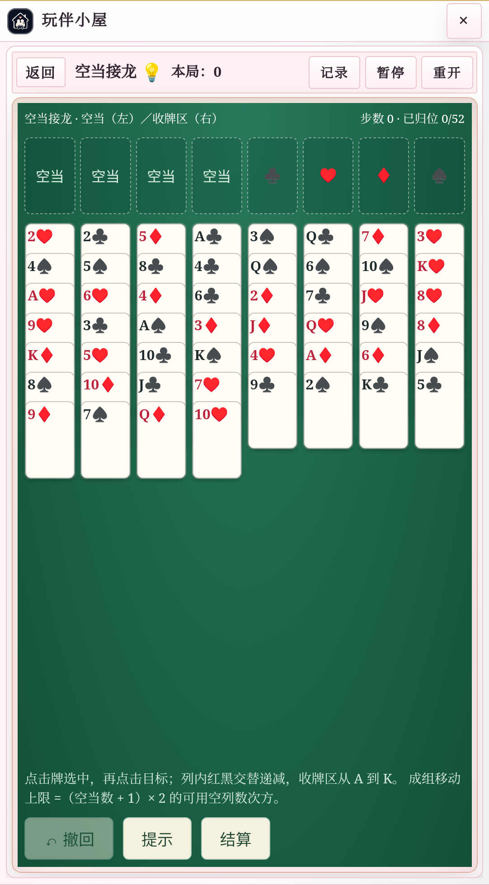
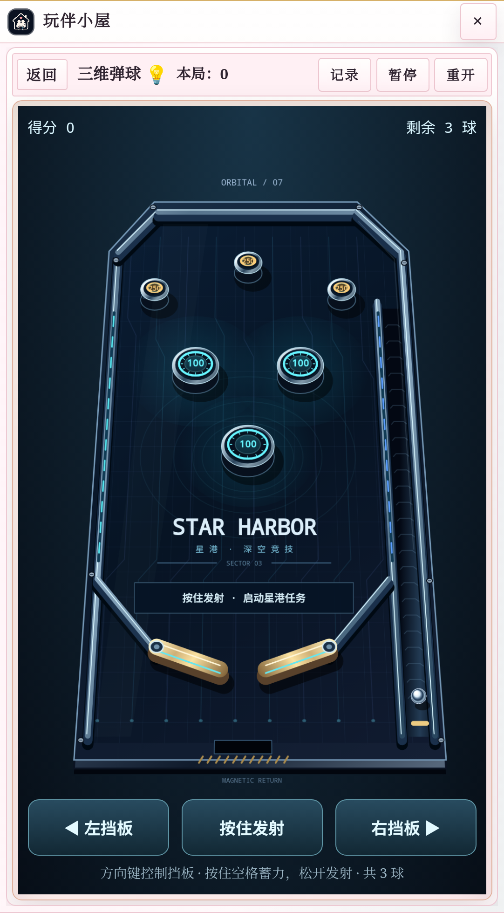
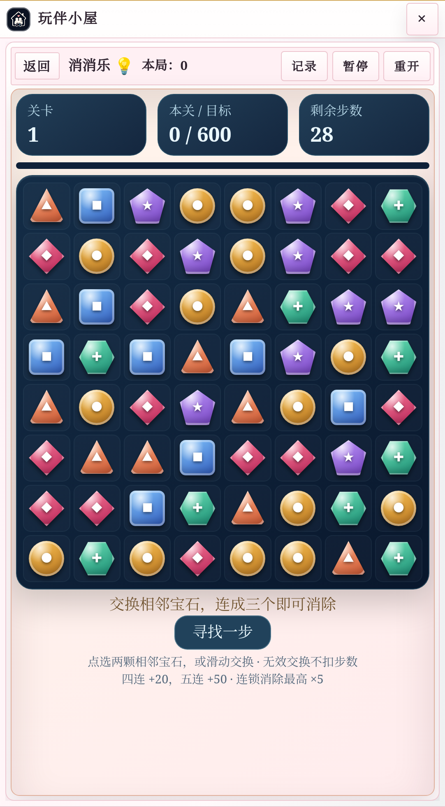

# Android Via 回归记录

2026-09-05。泡泡龙的确定性计时回归已通过；空当接龙、消消乐已通过 Android Via 的触控与进度恢复检查。三维弹球此前出现画布空白，修复后重新通过六项触控/状态检查，最终截图已由独立审查代理确认桌面与挡板完整可见。

## 环境与范围

- Android Emulator，ARM64，Android 15 / API 35；Via 7.3.3；Chromium/WebView 124.0.6367.219。
- Via 页面实测视口 412 × 746 CSS px，DPR 2.625。不是仅把桌面浏览器 UA 改成 Android，也不是实体手机测试。
- 页面加载本仓库实际插件 runtime、模块和 CSS；`tests/browser/index.html` 提供最小 SillyTavern context stub、jQuery 和测试钩子。**这不是完整 SillyTavern 酒馆联调**，不包含角色聊天、第三方主题、宿主插件组合或真实用户存档。
- 新局准备使用 `wbTest.prepare` 钩子；发牌后移动、撤回、发射、双指挡板、暂停、返回和继续进度通过 Android DevTools 触控事件操作。状态快照用于断言，不代替这些游戏动作。

## 根因与修复

1. 泡泡龙掉落以回调次数推进，低回调频率时真实时间速度下降；暂停仍推进部分效果，旧循环和延迟回调未完整清理。改为按经过时间积分，保留碰撞子步，并统一暂停与销毁处理。
2. runtime 的继续进度判断与新模块存档结构不一致，例如消消乐是 8 × 8 二维棋盘，曾被当成长度 64 的一维棋盘检查。新增两条真实 runtime 判定回归，覆盖可继续与已结束状态。
3. 重开先清存档后停止旧控制器，旧控制器的 `save()` 会把刚清掉的进度写回来。新增三个游戏的重开回归，约束丢弃旧快照再渲染新局。
4. 消消乐初次挂载未替换“准备开始”占位层，导致棋盘被挤出视口；已改为替换内容、按容器高度布局，并修正文字对比度。三维弹球的 Canvas 像素已有内容，但 Android 硬件画布没有呈现；`0e7347e` 为 2D context 设置 `willReadFrequently:true` 使用 CPU 支持的画布后恢复可见，`58cbabc` 同时修正等比布局。新的 `via-pinball-flippers.png` 已通过独立视觉检查。

## 证据与结论

选定原始证据随仓库保存在 [docs/evidence](evidence/)，完整本地记录位于仓库旁的 `../artifacts/user-house-via/`。

| 证据 | 已确认结果 | 能证明什么 |
| --- | --- | --- |
| `paopao-before.tap` / `paopao-after.tap` | 原版 7 条全部失败；修复后 7 条全部通过 | 同一实际游戏函数在确定性时钟下的计时、暂停、重启和长间隔回归 |
| `paopao-suite.tap` | 12/12 通过 | 扩展后的泡泡龙回归集合 |
| `integrated-tests.tap` | 最终 49/49 通过 | 游戏规则、计时、生命周期、存档、重开及弹球高 DPI 预算 |
| `progress-before.tap` | 2 条中 1 条失败 | runtime 的存档结构不匹配能够复现 |
| `via-freecell-checks.json` | `passed:true`，无横向溢出、无页面错误 | 触控入空当、撤回、暂停、倒计时恢复、大厅重新进入后恢复牌局与步数 |
| `via-match3-checks.json` | `passed:true`，无横向溢出、无页面错误 | 有效交换只扣一步且得分、暂停、倒计时恢复、大厅重新进入后恢复棋盘与步数 |
| `via-pinball-checks.json` | 重跑 `passed:true`；最终截图已确认可见 | 按住释放发射、双指挡板、暂停与恢复分数/球数；画面由另一次截图审查确认 |

`before-android-via.json` 与 `after-android-via.json` 的 `pauseFrozen` 从 `false` 变为 `true`，两次都没有页面错误。原始 `samples[].fps` 是测试钩子**请求的回调上限（60/10）**，并非测得的屏幕刷新率或实际 native FPS。修复后约 610 ms 两组掉落 y 为 221.79 与 227.89，原版为 65.92 与 60.62。异步采样、设备调度与末次回调时刻会带来差异，不能用这两组数宣称“真实设备精确等速”；精确等速结论来自合成时间戳的确定性测试。`after-desktop.json` 也只是同类浏览器采样，不作帧率基准。

最终分支已通过全部 **49 项测试**。三个新游戏在 Via 中的最终触控检查分别为 7 项、7 项、6 项（空当接龙、弹球、消消乐），均包含实际“重开 → 确定 → 开始游戏”后丢弃旧进度。泡泡龙另有 6 项实际设备流程回归，包含限帧触控发射、暂停、倒计时恢复、Android Home 进入后台再切回不追赶时间、重开以及退出清除动画循环，见 `via-paopao-checks.json`。

弹球根据视觉反馈进一步升级了统一透视机箱、金属立体碰撞器/挡板、灯带、电路底纹、球体高光、拖尾和碰撞光效。最高 2 倍自适应位图密度与离屏静态缓存兼顾清晰度和开销。升级后重新完成 Via 触控回归，并人工查看截图确认正常显示；这不等于保证任意实体设备上的固定帧率。

三个新图标由 imagegen 参考现有日夜背景与粉蓝角色制作，提示词见 [game-icon-prompts.md](game-icon-prompts.md)。

| 空当接龙 | 三维弹球 | 消消乐 |
| --- | --- | --- |
|  |  |  |


## 复现

在仓库根目录，使用支持 ES modules、内置 `fetch` 和 `WebSocket` 的 Node.js（本次 Node 24）以及 Python 3：

```sh
node --test tests/*.test.mjs
node --test tests/paopao-timing.test.mjs tests/runtime-progress.test.mjs tests/runtime-restart.test.mjs
```

为隔离宿主准备一个证据目录，在其中放置 `jquery.min.js`（测试宿主的本地依赖），然后启动服务：

```sh
python3 tests/browser/serve.py --port 8765 --artifacts ../artifacts/user-house-via
```

要复现原版 A/B，在另一个终端用独立端口启动；需本地存在 `upstream/main` Git 引用：

```sh
python3 tests/browser/serve.py --port 8766 --artifacts ../artifacts/user-house-via --upstream
```

在已授权的 Android 测试设备开启 Via WebView 调试，连接 ADB，按实际设备序列号替换下例的 `emulator-5554`。通过 `adb shell cat /proc/net/unix` 查到该 Via 进程的 `webview_devtools_remote_…` socket 后，用真实名称替换占位符：

```sh
adb -s emulator-5554 reverse tcp:8765 tcp:8765
adb -s emulator-5554 reverse tcp:8766 tcp:8766
adb -s emulator-5554 forward tcp:9223 localabstract:WEBVIEW_SOCKET_NAME
```

Via 打开 `http://127.0.0.1:8765/`，原版打开端口 8766；点击“A/B 回归”会提交 `before/after-android-via.json`。工具栏“打开”总是准备新局，**不能用它检验继续进度**，继续进度必须走游戏内“返回 → 游戏卡片 → 继续”。

运行触控回归，输出 JSON 和 ready/paused/restored 等截图：

```sh
node tests/browser/android-games.mjs freecell ../artifacts/user-house-via
node tests/browser/android-games.mjs match3 ../artifacts/user-house-via
node tests/browser/android-games.mjs pinball ../artifacts/user-house-via
node tests/browser/android-paopao.mjs ../artifacts/user-house-via
```

`android-cdp.mjs` 只选择 9223 调试端口下 URL 以 `http://127.0.0.1:876` 开头的测试页面；若没有匹配页面会失败。它也支持 `node tests/browser/android-cdp.mjs /path/to/read-only-inspection.js` 执行自备检查脚本。最后检查 JSON 的 `passed`、`errors` 和截图；弹球尤其需要确认桌面、挡板与球确实可见，不能只接受状态断言。
